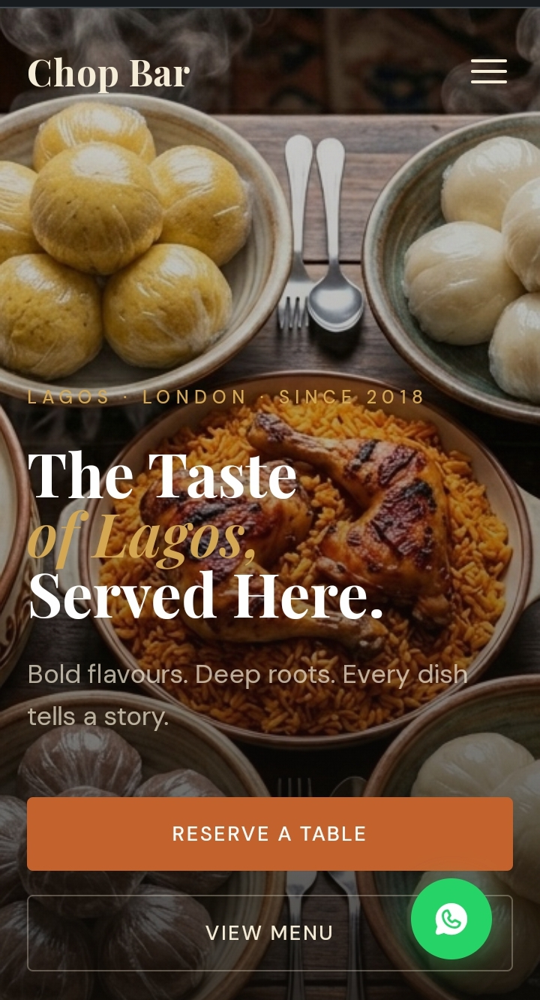

# Chop Bar — Authentic Nigerian Restaurant Website

> A premium single-page restaurant website for a fictional Nigerian dining experience based in Peckham, London. Built to demonstrate real-world frontend skills for small business and hospitality clients.

---

<!-- SCREENSHOT: Replace the block below with your actual screenshot -->
<!-- Tip: Take a full-page screenshot using Chrome DevTools > Capture full size screenshot -->
<!-- Recommended tool: GoFullPage Chrome extension or Awesome Screenshot -->



---

## Live Demo

🔗 [View Live Site](https://feyisara-o.github.io/nigerian-cuisine/)

---

## About This Project

Chop Bar is a fully responsive, production-quality restaurant landing page designed for a Nigerian cuisine brand. The project solves a real problem — most Nigerian restaurants in the diaspora have no professional web presence, losing customers to competitors with more polished digital storefronts.

This site is built to be immediately deployable for a real restaurant client with minimal changes.

---

## Features

- **Sticky navigation** — transparent on hero, solid on scroll with smooth active section highlighting
- **Animated hero** — full-viewport background image with staggered text entrance animations
- **Scrolling ticker strip** — continuous dish name marquee in branded terracotta
- **Tabbed menu system** — 4 categories (Starters, Mains, Soups, Drinks) with 16 dishes, spice indicators, and dietary tags
- **Masonry-style gallery** — asymmetric grid layout with hover zoom
- **Catering packages** — 3-tier pricing cards (Private, Corporate, Wedding) over a full-bleed image
- **Reservation form** — date/time/guest selectors with a success state on submission
- **Horizontal reviews strip** — scrollable guest testimonials
- **WhatsApp integration** — floating action button and inline CTA, matching how Nigerian restaurant owners actually communicate with customers
- **Scroll reveal animations** — staggered entrance animations on every section using IntersectionObserver
- **Mobile hamburger menu** — full-screen slide-in overlay
- **Fully responsive** — mobile-first layout across all breakpoints

---

## Tech Stack

| Technology | Purpose |
|---|---|
| HTML5 | Semantic structure |
| CSS3 + Custom Properties | Styling, animations, responsive layout |
| Vanilla JavaScript | Interactions, scroll behaviour, form handling |
| Google Fonts (CDN) | Playfair Display + DM Sans typography |
| Phosphor Icons (CDN) | WhatsApp, Instagram, Facebook, TikTok icons |

No frameworks. No build tools. No dependencies to install.

---

## Project Structure

```
chop-bar/
├── index.html        # All markup and content
├── style.css         # All styles and animations
├── script.js         # All interactions and scroll logic
├── README.md         # This file
└── images/           # Local food photography (AI-generated)
    ├── hero.jpg
    ├── about.jpg
    ├── catering.jpg
    ├── suya.jpg
    ├── akara.jpg
    ├── puff-puff.jpg
    ├── asun.jpg
    ├── jollof-rice.jpg
    ├── pounded-yam.jpg
    ├── ofada-rice.jpg
    ├── moi-moi.jpg
    ├── pepper-soup.jpg
    ├── oha-soup.jpg
    ├── banga-soup.jpg
    ├── efo-riro.jpg
    ├── chapman.jpg
    ├── zobo.jpg
    ├── palm-wine.jpg
    ├── kunu.jpg
    ├── gallery-1.jpg
    ├── gallery-2.jpg
    ├── gallery-3.jpg
    ├── gallery-4.jpg
    └── gallery-5.jpg
```

---

## Getting Started

No installation required.

```bash
# Clone the repo
git clone https://github.com/Feyisara-o/chop-bar.git

# Open in browser
open index.html
```

Or simply drag `index.html` into any browser.

---

## Design Decisions

**Aesthetic:** Warm editorial luxury — deep near-black background, terracotta accent, gold highlights, cream text. Inspired by high-end Lagos dining culture meets a Condé Nast food editorial.

**Typography:** Playfair Display (headings) paired with DM Sans (body) — elegant but grounded. The italic gold display text creates a cultural warmth without being decorative for its own sake.

**Single-page layout:** Restaurant visitors have one of two goals — check the menu or make a booking. A single page gets them there with one scroll, no navigation decisions. The sticky nav with active section highlighting maintains orientation throughout.

**WhatsApp CTA:** Deliberately included over a phone number because Nigerian restaurant owners and their clientele overwhelmingly prefer WhatsApp for bookings and enquiries. This is a real-world UX decision.

**Food imagery:** All dish photos are AI-generated using Microsoft Designer to ensure accurate visual representation of Nigerian cuisine — something stock photo libraries consistently fail to provide.

---

## What I Learned

- Managing complex CSS layouts with custom properties for consistent theming across sections
- Building a seamless infinite CSS ticker animation with duplicated content
- Using `IntersectionObserver` for performant scroll-reveal with staggered animation delays
- Handling sticky nav transparency transitions without JavaScript scroll jank
- Structuring a single-page site so each section reads as a standalone visual experience

---

## Potential Extensions

- [ ] Connect reservation form to EmailJS for real email delivery
- [ ] Add a lightbox to the gallery section
- [ ] Animate the menu tab transitions with a slide/fade effect
- [ ] Add a "Dish of the Day" dynamic banner
- [ ] Integrate Google Maps embed in the contact section

---

## Target Client Profile

This project demonstrates skills relevant to:

- **Nigerian/African restaurants** in the diaspora (UK, US, Canada) needing a professional online presence
- **Small food businesses** — catering companies, pop-ups, supper clubs
- **Hospitality agencies** building sites for restaurant clients

---

## Author

**Feyisara** — Frontend Developer & Designer

- GitHub: [@Feyisara-O](https://github.com/Feyisara-o)
- LinkedIn: [linkedin.com/in/feyisara](https://www.linkedin.com/in/mofeyisara-okunola-73121b277?utm_source=share_via&utm_content=profile&utm_medium=member_android)
- Upwork: [upwork.com/freelancers/feyisara](https://upwork.com/freelancers/feyisara)

---

*Built with vanilla HTML, CSS, and JavaScript — no frameworks, no fluff.*
